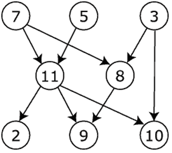

# Lecture 16: Topological Sort & Graph Traversals

>Note: The most of the information of these lectures was extracted and adapted from Dr Bajuelos and from Weiss’s book, “Data Structures and Algorithm Analysis in Java". They are provided for COP3530 students only. Not to be published or publicly distributed without permission by the publisher. 

## Graphs. Review

A graph G = <V,E> consists of a set of vertices, V, and a set of edges, E. 

Each edge is a pair (v,w), where v, w ∈ V. If the pair is ordered, then the graph is directed. 

Directed graphs are sometimes referred to as digraphs.

Edges in the digraphs have a direction and in general for every (u,v) ∈ E ⇏ (v,u) ∈ E. The vertex u is the source and the vertex v the destination.

In-degree of a vertex: number of edges where the vertex is the destination. 

Out-degree of a vertex: number of edges where the vertex is the source.

A cycle is a path that begins and ends at the same node (v<sub>j</sub>=v<sub>k</sub>). 


## Topological Sort 


A topological sort is an ordering of vertices in a directed acyclic graph (DAG), such that if there is a path from vertex u to vertex v, then v appears after u in the ordering. 


A directed edge (v,w) indicates that course v must be completed before course w may be attempted. 

A topological ordering of these courses is any course sequence that does not violate the prerequisite requirement.

### Directed definition:

A topological sort or topological ordering of a directed acyclic graph (DAG) is a linear ordering of its vertices such that for every directed edge (u,v) in E, the vertex u comes before v in the topological ordering.




Topological sort example: 7, 5, 3, 11, 8, 2, 10, 9  


## Some facts:

Topological ordering is not possible if the graph has a cycle, since for two vertices u and v on the cycle, u precedes v and v precedes u.


The ordering is not necessarily unique; any legal ordering will do. 

Example: 


* v<sub>1</sub>, v<sub>2</sub>, v<sub>5</sub>, v<sub>4</sub>, v<sub>3</sub>, v<sub>7</sub>, v<sub>6</sub> 
* v<sub>1</sub>, v<sub>2</sub>, v<sub>5</sub>, v<sub>4</sub>, v<sub>7</sub>, v<sub>3</sub>, v<sub>7</sub> 

Both topological orderings.

## Topological Sort. The First Algorithm 
>Algorithm #1

Mark each vertex with its in-degree
(via a data structure e.g. array)


| Vertex | in-degree |
|---|---|
| 0	 |  0
| 1	 |  1
| 2	 |  2
| 3	 |  1
| 4	 |  2
| 5	 |  2


While there are vertices not yet output:
* Choose a vertex v with labeled with in-degree of 0
* Output v and “remove” it from the graph
* For each vertex u adjacent to v, decrement the in-degree of u


There exists at least one vertex with indegree equal to cero.

Proof: Suppose that there exists a graph with no cycles and there are no nodes of indegree 0. Then each node has indegree 1 or higher. 

Pick any node, since its indegree is 1 or higher we can go to its parent node. This node has also indegree 1 or higher and so we can keep doing this procedure until we arrive at the node we already visited. 

This will prove that there exists a cycle which contradicts our initial assumption. So we proved that every directed graph with no cycles has at least one node of indegree zero.


Example:


## Algorithm Analysis
```text
    labelEachVertexWithItsInDegree();
	for(counter=0; counter < numVertices; counter++)
    {
    	   v = findNewVertexOfDegreeZero();
         put v next in output
	     for each w adjacent to v
             w.indegree--;
    }
```

### Worst-case running time?

* Initialization: O(|V|+|E|) (if we use an adjacency list)
* Sum of all find-new-vertex: O(|V|2) (because each O(|V|))
* Sum of all decrements: O(|E|) (assuming adjacency list)
* Total:  O(|V|2 + |E|) - Quadratic time!

Not good for a graph with |V|2 >> |E| (sparse graph)

.

.

.

### Improved version. Algorithm #2

The artifice is to avoid searching for a zero-degree vertex every time!

How we can do to do this?
* Keep the “pending” zero-degree vertices in a list, stack, queue, bag, table, etc.

Example using a queue:
* Label each vertex with its in-degree, enqueue 0-degree vertices
* While queue is not empty
    * v = dequeue()
    * Output v and “remove” it from the graph
    * For each vertex u adjacent to v, decrement the in-degree of u, if new degree is 0, enqueue it


## Topological Sort

```text
    labelAllAndEnqueueZeros();
	for(counter=0; counter < numVertices; counter++)
    {
         v = dequeue();
         put v next in output
	     for each w adjacent to v 
        {
              w.indegree--;
              if(w.indegree==0) 
                 enqueue(w);
        }
    }

```
Worst-case running time?

* Initialization: O(|V|+|E|) (if we using an adjacency list)
* Sum of all enqueues and dequeues: O(|V|)
* Sum of all decrements: O(|E|) (assuming adjacency list)
* Total: O(|V| + |E|) - Linear running time!

## Topological Sort. Real life Application 

Consider the problem of scheduling tasks which are inter-dependent i.e. let's say task A can only be done after task B and C have been completed. 

We can model such dependencies using a Directed Acyclic Graph (DAG) which would contain an edge B→A and C→A in the above example. 

A topological sort of such a graph would give us an ('an', not 'the') order in which these tasks could be completed.

Topological sort can be used to convert a directed acyclic graph into a linear order.


## Topological Sort Implementation
This uses Breadth First graph Search (BFS) which we will cover next.

```java 
// find the indegree of a node by adding in-edge count
public static <T> Map<T, Integer> findInDegree(Map<T, List<T>> graph) {
    Map<T, Integer> inDegree = new HashMap<>();
    graph.keySet().forEach(node -> {
        inDegree.put(node, 0);
    });
    // loop through every node and add 1 in-edge count to its neighbors
    graph.entrySet().forEach(entry -> {
        for (T neighbor : entry.getValue()) {
            inDegree.put(neighbor, Indegree.get(neighbor) + 1);
        }
    });
    return inDegree;
}

// topological sort the list
public static <T> List<T> topoSort(Map<T, List<T>> graph) {
    // return a list of the topological sorted list
    List<T> res = new ArrayList<>();
    // make a queue that we will use for our solution
    Queue<T> q = new ArrayDeque<>();
    // loop through all nodes and add all nodes that have 0 in-degree
    Map<T, Integer> inDegree = findInDegree(graph);
    inDegree.entrySet().forEach(entry -> {
        if (entry.getValue() == 0) {
            q.add(entry.getKey());
        }
    });
    // perform bfs with queue, mostly the same as template bfs
    while (!q.isEmpty()) {
        T node = q.poll();
        // add node to list to keep track of topological order
        res.add(node);
        for (T neighbor : graph.get(node)) {
            // subtract one from every neighbour
            inDegree.put(neighbor, inDegree.get(neighbor) - 1);
            // once the in-degree reaches 0 you add it to the queue
            if (inDegree.get(neighbor) == 0) {
                q.add(neighbor);
            }
        }
    }
    // check for cycle
    return (graph.size() == res.size()) ? res : null;
}
```

## Graph Traversals 

The next problem: 

For an arbitrary graph and a starting vertex v, traverse a graph, i.e explore every vertex in the graph exactly once. 

Because there are many paths leading from one vertex to another, the hardest part about traversing a graph is making sure that you do not process some vertex twice. 

Basic ideas:

```java
traverseGraph(Vertex start)
{
	  Set pending = emptySet()
	  pending.add(start)
     mark start as visited
     while(pending is not empty)
     {
       next = pending.remove()
       for each vertex u adjacent to next
          if(u is not marked)
          {
              mark u
              pending.add(u)
          }
     }
}
```
Important points:  

Note that is important that add and remove are O(1).

The order we traverse depends entirely on add and remove.
* If we use and stack: Depth First graph Search (DFS)
* If we use and queue: Breadth First graph Search (BFS)

So DFS recursively explore one part before going back to the other parts not yet explored and

BFS explore areas closer to the start node first

Time complexity of the DFS and BFS is O(|V|+|E|)

## Depth First graph Search (DFS)

Depth First Traversal (or Search) for a graph is similar to Depth First Traversal of a tree. The only catch here is, that, unlike trees, graphs may contain cycles (a node may be visited twice). To avoid processing a node more than once, use a boolean visited array. A graph can have more than one DFS traversal.

DFT recursively explore one part before going back to the other parts not yet explored.

Pseudocode for DFS
```java
void dfs(Vertex v)
{
    v.visited = true;
    for each vertex w adjacent to v
        if( !w.visited )
            dfs(w);
}
```

DFS visualization:

https://www.cs.usfca.edu/~galles/visualization/TopoSortDFS.html

## Graph Traversals. DFS  

So DFS recursively explore one part in depth before going back to the other parts not yet explored.

DFS explores a path all the way to a leaf before backtracking and exploring another path.

After searching A, then B, then D, the search backtracks and tries another path from B.

Node are explored in the order:
* A B D E H L M N I O P C F G J K Q


DFS (pseudocode using one stack)


Example of DFS using a stack


Output: A, G, F, E, C, D, B

Stack  Status


Rememeber LIFO

## Graph Traversals. BFS  

BFS explores areas closer to the start node first
A breadth-first search (BFS) explores nodes nearest the root before exploring nodes further away


Example of BFS using a queue


Output: A, B, G, C, F, D, E  


Rememeber FIFO

## Implementation

DFS (recursively)

```java
public static void DFS(Graph g, int v, boolean[] visited) 
{
    visited[v] = true;
    System.out.println(v);
    Iterator<Edge> iter = g.edgeIterator(v);
    while (iter.hasNext()) 
    {
        int neighbor = iter.next().getDest();
        if (!visited[neighbor])
            DFS(g, neighbor, visited);
    }
}

public static void DFSStart(Graph g, int startVertex) 
{
    int i;
    boolean[] visited = new boolean[g.getNumV()];
    for (i=0; i<visited.length; i++) 
    {
        visited[i] = false;
        DFS(g, startVertex, visited);
    }
}
```


BFS

```java
public static void BFS(Graph g, int v)
{
    boolean[] visited = new boolean[g.getNumV()];
    Queue<Integer> q = new Queue<Integer>();
    visited[v] = true;
    q.enqueue(v);
    while (!q.isEmpty()) 
    {
        int current = q.dequeue();
        System.out.println(current);
        Iterator<Edge> iter = g.edgeIterator(current);
        while (iter.hasNext()) 
        {
            neighbor = iter.next().getDest();
            if (!visited[neighbor]) 
            {
                visited[neighbor]=true;
                q.enqueue(neighbor);
            }
        }
    } // end while !q.isEmpty()
}

```
## Graph Traversals. DFS & BFS complexity  


To calculate the time complexity of the DFS & BFS algorithms, we observe that every node is "visited" exactly once during the execution of the algorithm. 

Also, every edge (u,v) is "crossed" twice: 
* one time when node v is checked from u to see if it is visited (if not visited, then v would be visited from u)
* another time, when we back track from v to u. 

Therefore, the running time of DFS and BFS is O(|V| + |E|). 

## Graph Traversals. DFS & BFS for Digraphs  

Not strongly connected graph!


## Class Problem

Determine whether a graph is Bipartite using DFS

Given an undirected graph, determine whether it is bipartite using DFS. A bipartite graph (or bigraph) is a graph whose vertices can be divided into two disjoint sets U and V such that every edge connects a vertex in U to one in V.

The following is a bipartite graph as we can divide it into two sets, U and V, with every edge having one endpoint in set U and the other in set V:


It is possible to test whether a graph is bipartite or not using a Depth–first search (DFS) algorithm. There are two ways to check for bipartite graphs:

* A graph is bipartite if and only if it is 2–colorable.
* A graph is bipartite if and only if it does not contain an odd cycle.

The main idea is to assign each vertex a color that differs from its parent’s color in the depth–first search tree. If there exists an edge connecting the current vertex to a previously colored vertex with the same color, then we can say that the graph is not bipartite.

```java
import java.util.ArrayList;
import java.util.Arrays;
import java.util.List;
 
// A class to store a graph edge
class Edge
{
    int source, dest;
 
    public Edge(int source, int dest)
    {
        this.source = source;
        this.dest = dest;
    }
}
 
// A class to represent a graph object
class Graph
{
    // A list of lists to represent an adjacency list
    List<List<Integer>> adjList = null;
 
    // Total number of nodes in the graph
    int n;
 
    // Constructor
    Graph(List<Edge> edges, int n)
    {
        this.adjList = new ArrayList<>();
        this.n = n;
 
        for (int i = 0; i < n; i++) {
            adjList.add(new ArrayList<>());
        }
 
        // add edges to the undirected graph
        for (Edge edge: edges)
        {
            int src = edge.source;
            int dest = edge.dest;
 
            adjList.get(src).add(dest);
            adjList.get(dest).add(src);
        }
    }
}
 
class Main
{
    // Perform DFS on the graph starting from vertex `v`
    public static boolean DFS(Graph graph, int v, boolean[] discovered, boolean[] color)
    {
        // do for every edge (v, u)
        for (int u: graph.adjList.get(v))
        {
            // if vertex `u` is explored for the first time
            if (discovered[u] == false)
            {
                // mark the current node as discovered
               
                //TODO
                
                // current node has the opposite color of that its parent
                
                //TODO

                // if DFS on any subtree rooted at `v` returns false
                
                
                //TODO
            }
            // if the vertex has already been discovered and
            // the color of vertex `u` and `v` are the same, then
            // the graph is not bipartite
            
             //TODO
        }
 
        return true;
    }
 
    // Function to check if a graph is Bipartite using DFS
    public static boolean isBipartite(Graph graph)
    {
        int n = graph.n;
 
        // to keep track of whether a vertex is discovered or not
        boolean[] discovered = new boolean[n];
 
        // keep track of the color assigned (0 or 1) to each vertex in DFS
        boolean[] color = new boolean[n];
 
        // start from any node as the graph is connected and undirected
        int src = 0;
 
        // mark the source vertex as discovered and set its color to 0
        discovered[src] = true;
        color[src] = false;
 
        // call DFS procedure
        return DFS(graph, src, discovered, color);
    }
 
    public static void main(String[] args)
    {
        // List of graph edges
        List<Edge> edges = Arrays.asList(
                new Edge(0, 1), new Edge(1, 2), new Edge(1, 7),
                new Edge(2, 3), new Edge(3, 5), new Edge(4, 6),
                new Edge(4, 8), new Edge(7, 8), new Edge(1, 3)
                // if we remove (1, 3) edge, the graph becomes bipartite
        );
 
        // total number of nodes in the graph (0 to 8)
        int n = 9;
 
        // build a graph from the given edges
        Graph graph = new Graph(edges, n);
 
        if (isBipartite(graph)) {
            System.out.println("Graph is bipartite");
        }
        else {
            System.out.println("Graph is not bipartite");
        }
    }
}

```
